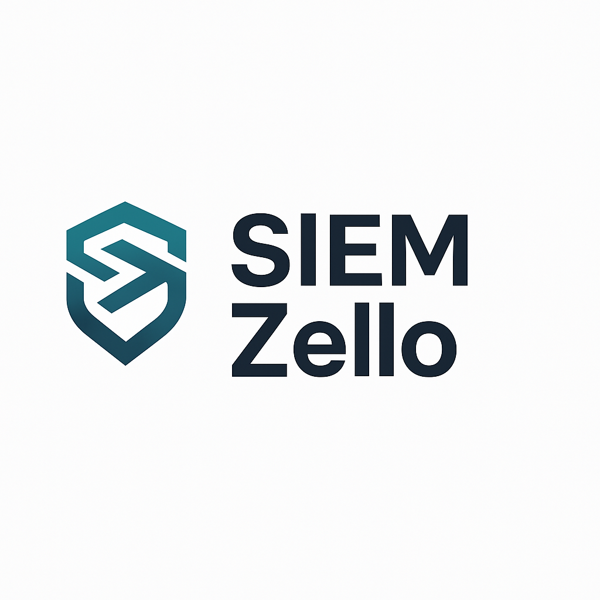
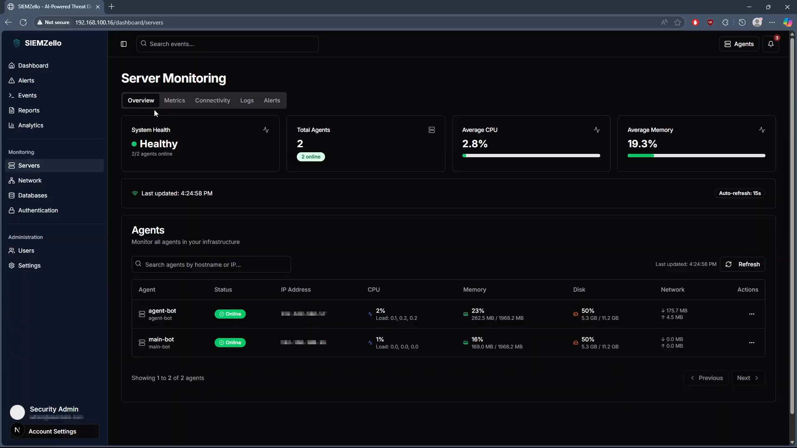
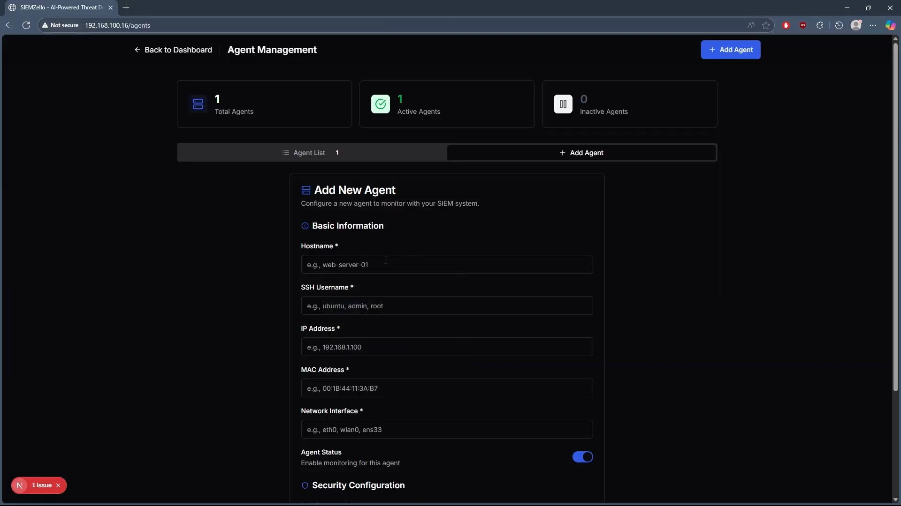
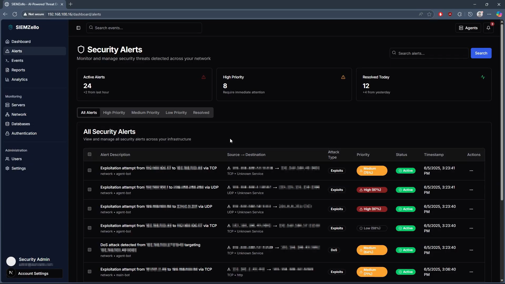
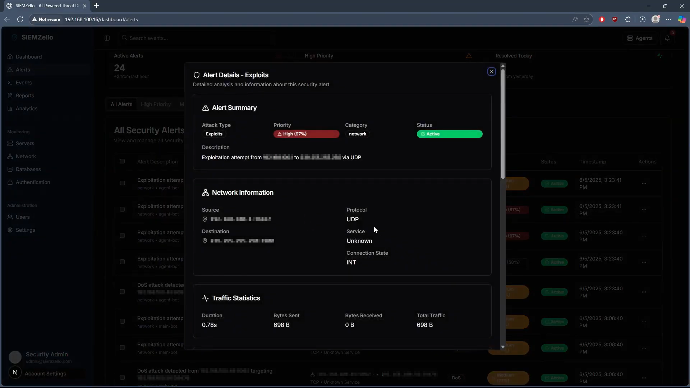
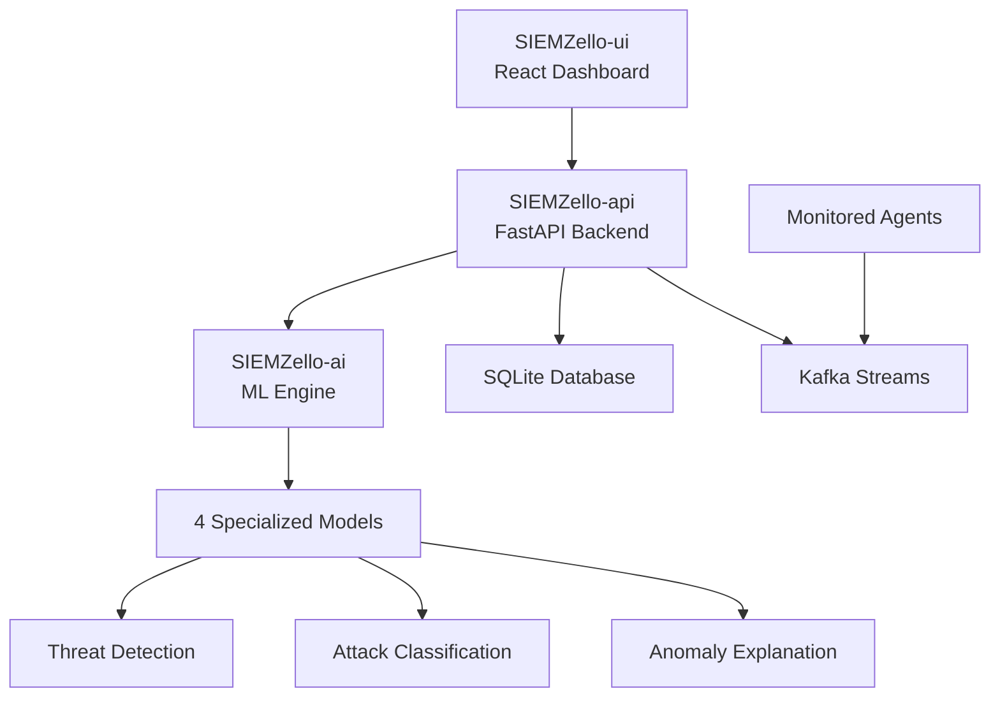

<div align="center">


*SIEMZello: AI-Powered Security Information and Event Management System*

[](https://nextjs.org/)
[](https://fastapi.tiangolo.com/)
[](https://www.typescriptlang.org/)
[](https://python.org/)
[](https://scikit-learn.org/)

**Intelligent threat detection meets modern web development**

[🚀 Live Demo](#) • [🔧 Installation](#installation) • [🤝 Team](#team)

</div>

---

## ✨ Overview

SIEMZello is a comprehensive, AI-powered Security Information and Event Management platform designed to provide real-time threat detection, system monitoring, and intelligent security analytics. Built with modern technologies and machine learning algorithms, it offers an intuitive interface for managing and monitoring security across distributed systems.

<div align="center">


*Real-time security dashboard with live metrics and threat visualization*

</div>

## 🎯 Key Features

### 🔍 **Intelligent Threat Detection**
- **AI-powered anomaly detection** with four specialized ML models
- **Real-time log analysis** for network, memory, disk, and process activities
- **Two-stage network analysis**: Detection + Classification
- **Explainable AI** with human-readable threat explanations

### 📊 **Live System Monitoring**
- **Real-time agent metrics** with 15-second auto-refresh
- **Interactive dashboards** with modern, responsive design
- **System health aggregation** across all monitored agents
- **Performance trend analysis** and historical data

<div align="center">


*Live agent monitoring with CPU, memory, disk, and network metrics*

</div>

### 🖥️ **Agent Management**
- **One-click agent deployment** with automated SSH configuration
- **Agent connectivity testing** and status monitoring
- **Secure credential management** with encrypted storage
- **Scalable architecture** supporting multiple monitoring targets


### 🚨 **Security Analytics**
- **Advanced threat visualization** with interactive charts
- **Alert management system** with severity classification
- **Security event explorer** with filtering and search
- **Compliance reporting** and audit trails

<div align="center">


*Comprehensive security alerts dashboard with threat analysis*

</div>

### 💾 **Log Management**
- **Centralized log collection** from all monitored systems
- **Intelligent log categorization** with ML-based classification
- **Attack probability scoring** for each security event
- **Historical log analysis** and trend identification

<div align="center">


*Comprehensive description on any selected log, explaining the issue*

</div>

## 🏗️ Architecture



## 🛠️ Technology Stack

### Frontend
- **Next.js 15.2.4** - Modern React framework
- **TypeScript** - Type-safe development
- **TailwindCSS** - Utility-first styling
- **shadcn/ui** - Beautiful component library
- **Recharts** - Data visualization

### Backend
- **FastAPI** - High-performance Python API
- **SQLite** - Lightweight database
- **Kafka** - Message streaming
- **Pydantic** - Data validation

### AI/ML
- **Scikit-learn** - Machine learning models
- **Pandas** - Data processing
- **NumPy** - Numerical computations
- **Custom Models** - Domain-specific analyzers

## 🚀 Quick Start

### Installation

```bash
# Clone the repository
git clone https://github.com/your-org/siemzello.git
cd siemzello

# Frontend setup
cd SIEMZello-ui/siemzello-ui
pnpm install && pnpm dev

# Backend setup
cd ../../SIEMZello-api
pip install -r requirements.txt
uvicorn app.main:app --reload

# AI Engine setup
cd ../SIEMZello-ai
pip install -r requirements.txt
uvicorn main:app --reload --port 5000
```

### Configuration

1. **Add your first agent** through the web interface
2. **Configure SSH credentials** for secure monitoring
3. **Deploy monitoring scripts** with one-click automation
4. **Start monitoring** and view real-time metrics

## 📈 Features in Action

### Real-time Monitoring
- Live CPU, memory, disk, and network metrics
- Agent connectivity status and health checks
- System performance trends and alerts
- Auto-refresh every 15 seconds

### AI-Powered Analysis
- Network traffic anomaly detection
- Memory usage pattern analysis
- Disk activity monitoring
- Process behavior analysis

### Security Management
- Threat probability scoring
- Attack type classification
- Security event correlation
- Automated incident response

## 🔐 Security Features

- **JWT Authentication** - Secure API access
- **SSH Key Management** - Encrypted agent communication
- **Role-based Access Control** - User permission management
- **Audit Logging** - Complete action tracking
- **Data Encryption** - Sensitive information protection

## 📖 Documentation
You will find all the documentation in [SIEMZello-Core](https://github.com/SIEMZello/SIEMZello-core/tree/main/docs)
- 📋 Complete Installation Guide
- 🏗️ Architecture Overview
- 🔌 API Documentation
- 👨‍💻 Developer Setup
- 📊 Project Report

## 🤝 Team

<div align="center">

### 🎓 **INSAT Computer Science Students**
*Academic Year 2024-2025*

<table>
  <tr>
    <td align="center">
      <a href="https://github.com/Jozziiff">
        
      </a>
      <br />
      <sub><b><a href="https://github.com/Jozziiff" style="text-decoration: none; color: inherit;">Youssef Hamdani</a></b></sub>
      <br />
      <sub>Full-Stack & Security</sub>
    </td>
    <td align="center">
      <a href="https://github.com/youssefnoob003">
        
      </a>
      <br />
      <sub><b><a href="https://github.com/youssefnoob003" style="text-decoration: none; color: inherit;">Youssef Charfeddine</a></b></sub>
      <br />
      <sub>Backend & Networks</sub>
    </td>
    <td align="center">
      <a href="https://github.com/manticore999">
        
      </a>
      <br />
      <sub><b><a href="https://github.com/manticore999" style="text-decoration: none; color: inherit;">Hamza Badreddine</a></b></sub>
      <br />
      <sub>ML & AI</sub>
    </td>
    <td align="center">
      <a href="https://github.com/Rayen-Hamza">
        
      </a>
      <br />
      <sub><b><a href="https://github.com/Rayen-Hamza" style="text-decoration: none; color: inherit;">Rayen Hamza</a></b></sub>
      <br />
      <sub>DevOps & Testing</sub>
    </td>
  </tr>
</table>

*Passionate computer science students from INSAT, dedicated to building innovative cybersecurity solutions that combine cutting-edge AI with practical security monitoring.*

</div>

## 🎯 Project Impact

- **🔒 Enhanced Security**: Proactive threat detection with AI-powered analysis
- **⚡ Real-time Monitoring**: Instant visibility into system health and security
- **🧠 Intelligent Analysis**: Machine learning models for accurate threat assessment
- **🎨 Modern Interface**: Intuitive, responsive design for optimal user experience
- **📊 Data-Driven Insights**: Comprehensive analytics for informed decision-making

## 🏆 Achievements

- ✅ **Complete SIEM Implementation** - Full-featured security monitoring platform
- ✅ **AI Integration** - Four specialized ML models for threat detection
- ✅ **Modern Architecture** - Microservices with scalable design
- ✅ **Real-time Processing** - Live metrics and instant threat analysis
- ✅ **Professional UI** - Production-ready dashboard interface

## 📄 License

This project is licensed under the MIT License - see the [LICENSE](LICENSE) file for details.

## 🚀 Future Roadmap

- [ ] **Mobile Application** - iOS and Android monitoring apps
- [ ] **Cloud Deployment** - AWS/Azure integration
- [ ] **Advanced ML Models** - Deep learning threat detection
- [ ] **Integration APIs** - Third-party security tools
- [ ] **Compliance Modules** - GDPR, HIPAA, SOX support

---

<div align="center">

**Built with ❤️ by the SIEMZello Team at INSAT**

*Combining academic excellence with practical cybersecurity innovation*

[⭐ Star this project](../../stargazers) • [🐛 Report Bug](../../issues) • [💡 Request Feature](../../issues)

</div>
